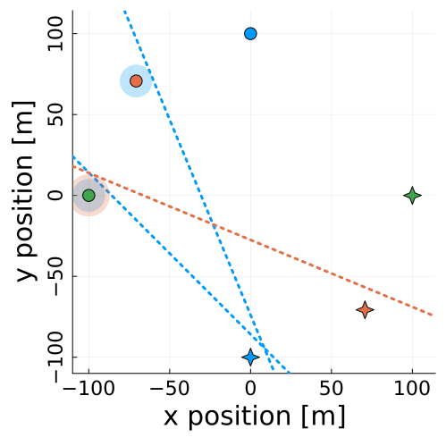
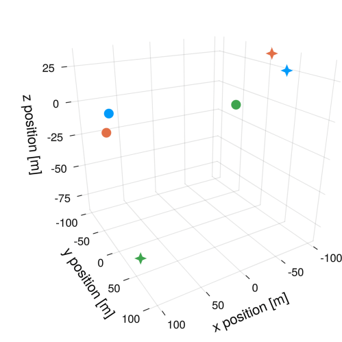

# InverseHyperplanes.jl

Collision-free trajectories for non-cooperative multi-agent systems using rotating hyperplanes constraints learned from expert trajectories by solving an inverse game.  Read the full paper [here](https://arxiv.org/abs/2311.09439). 

An example using Hill-Clohessy-Wiltshire equations for relative orbital motion:
<table>
  <tr>
    <td style="height: 10px;">1. Expert trajectories</td>
    <td style="height: 10px;">2. Learned hyperplanes</td>
    <td style="height: 10px;">3. Collision-free trajectory</td>
  </tr>
  <tr>
    <td valign="top"></td>
    <td valign="top"></td>
    <td valign="top"></td>
  </tr>
 </table>

## Paper Abstract 

A core challenge of multi-robot interactions is collision avoidance among robots with potentially conflicting objectives. We propose a game-theoretic method for collision avoidance based on rotating hyperplane constraints. These constraints ensure collision avoidance by defining separating hyperplanes that rotate around a keep-out zone centered on certain robots. Since it is challenging to select the parameters that define a hyperplane without introducing infeasibilities, we propose to learn them from an expert trajectory i.e., one collected by recording human operators. To do so, we solve for the parameters whose corresponding equilibrium trajectory best matches the expert trajectory.

Read the full paper [here](https://arxiv.org/abs/2311.09439).

## Setup

### Directory Layout

- `src/` contains the implementations of our method. This includes forward and inverse game solvers, visualization tools, and utilities to interface with [ParametricMCPs.jl](https://github.com/lassepe/ParametricMCPs.jl) and [TrajectoryGamesBase.jl](https://github.com/lassepe/TrajectoryGamesBase.jl).

- `experiments/` contains the code for reproducing the Monte Carlo analysis shown in the [paper](https://arxiv.org/abs/2311.09439). 

### Package setup

After cloning the repository
1. Navigate to the directory where you cloned this repo.
2. Open a Julia terminal hit `]` to activate package mode and activate the project by typing `activate .`
3. Still in package mode, run `instantiate` to install all required dependencies.
   
You should now be ready to use the package by including `using InverseHyperplanes` in your code, or running one of the existing examples, e.g., [generate collision-free trajectories given hyperplane parameters](#generate-collision-free-trajectories-given-hyperplane-parameters-forward-game).

### PATH License
This package uses the proprietary PATH solver under the hood (via [PATHSolver.jl](https://github.com/chkwon/PATHSolver.jl)).
Therefore, you will need a license key to solve larger problems.
However, by courtesy of Steven Dirkse, Michael Ferris, and Tudd Munson,
[temporary licenses are available free of charge](https://pages.cs.wisc.edu/~ferris/path.html).
Please consult the documentation of [PATHSolver.jl](https://github.com/chkwon/PATHSolver.jl) to learn about loading the license key.

## How to use this package

### Generate collision-free trajectories given hyperplane parameters (Forward game)
Let's start by generating a collision-free trajectory given a set of feasible hyperplane parameters. 
1. Run `include(examples/trajectory_game_example)`. If you have [Revise.jl](https://github.com/timholy/Revise.jl) installed (highly recommended), use `includet` instead.
2. Then, setup the experimental parameters shown in the paper by running `experiment_setup = setup_experiment()`
3. Once this is done, you can run the forward game solver by running `forward(experiment_setup.θ_truth, experiment_setup; visualize = true)`. This should save an animation named `test.gif` in the `figures/` folder.

Note that the time horizon of this trajectory is only 10 steps, so it may not be very interesting. 

### Learn hyperplane parameters from an expert trajectory (Inverse game)
To understand how to use this package to learn hyperplane parameters from an expert demonstration, take a look at this ADD LINK. 
It outlines the learning pipeline, and may be useful in understanding how the learning happens and how to format the expert trajectories. 

## Contact 

> Note: For any questions on how to use this code, do not hesitate to reach out to Fernando Palafox at [fernandopalafox@utexas.edu](mailto:fernandopalafox@utexa.edu) or open an issue.